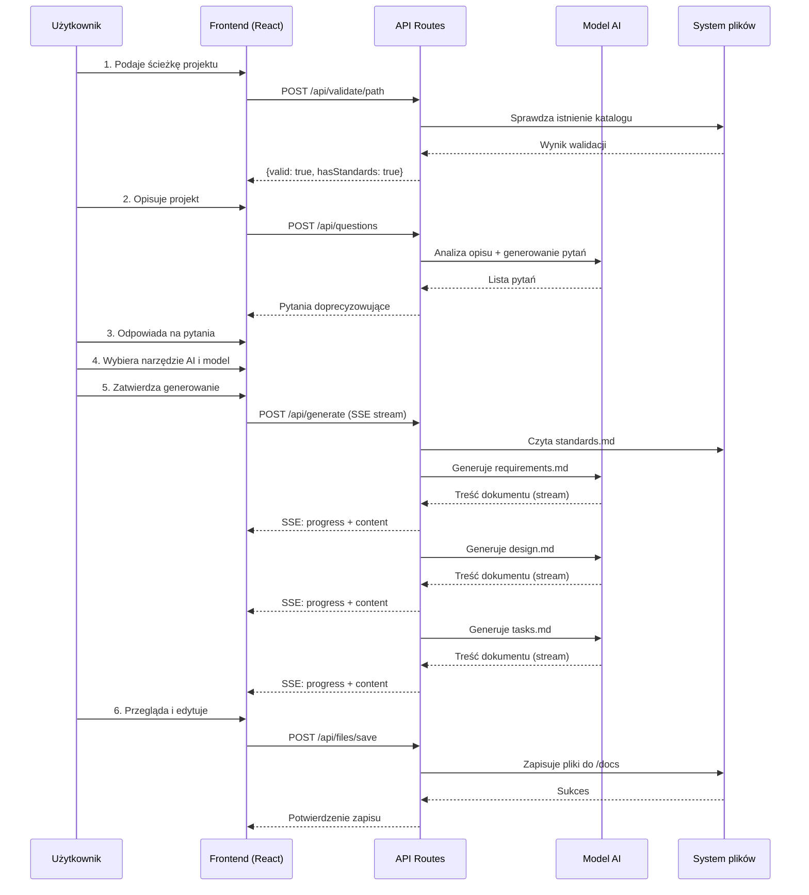
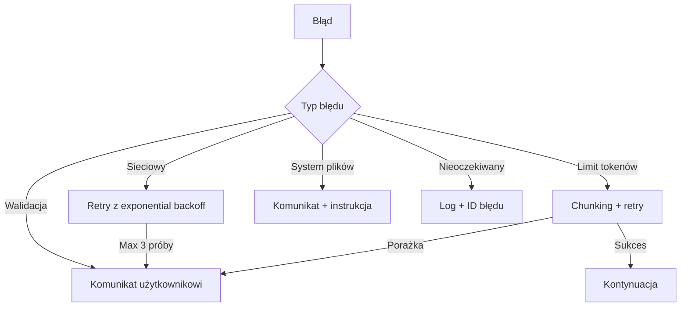
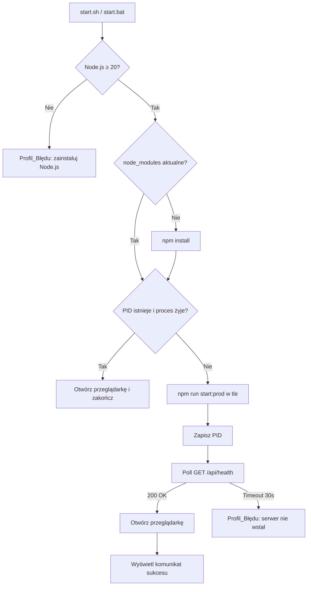
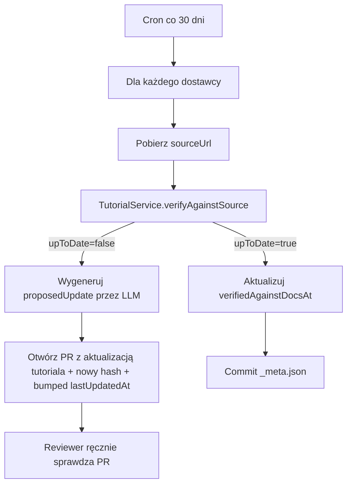

# Dokument Projektowy: Spec Generator

## Przegląd

Spec Generator to aplikacja webowa typu full-stack zbudowana na Next.js, która umożliwia nietechnicznym użytkownikom generowanie specyfikacji projektów zoptymalizowanych pod narzędzia AI. Aplikacja działa jako lokalny serwer deweloperski (localhost), co rozwiązuje problem dostępu do systemu plików użytkownika bez konieczności stosowania skomplikowanych mechanizmów przeglądarkowych.

### Kluczowe decyzje architektoniczne

1. **Next.js z App Router** — framework full-stack łączący frontend React z API Routes (backend Node.js), eliminujący potrzebę osobnego serwera
2. **Lokalne uruchomienie (localhost)** — aplikacja działa na maszynie użytkownika, co daje natywny dostęp do systemu plików przez Node.js `fs` w API Routes
3. **Brak bazy danych** — stan sesji przechowywany w pamięci przeglądarki (sessionStorage), klucze API nigdy nie opuszczają klienta w formie trwałej
4. **Streaming odpowiedzi AI** — wykorzystanie Server-Sent Events (SSE) do wyświetlania postępu generowania w czasie rzeczywistym
5. **next-intl** — biblioteka do internacjonalizacji z obsługą polskiego (domyślny) i angielskiego
6. **Persystowane preferencje** — lista ostatnio używanych projektów, znacznik `firstRunComplete` i meta tutorialów przechowywane w pliku `~/.spec-generator/preferences.json` (po stronie serwera Next.js, lokalnie na maszynie użytkownika); klucze API nigdy tam nie trafiają
7. **Skrypty natywne** — `start.sh`/`stop.sh` (POSIX) oraz `start.bat`/`stop.bat` (Windows) jako warstwa abstrakcji nad `npm install` i `next dev`/`next start`, zapewniająca obsługę bez terminala
8. **Zewnętrzny zasób treści tutoriali** — instrukcje zdobywania kluczy API trzymane w `content/tutorials/<provider>.<locale>.md` (możliwość aktualizacji bez deployu nowej wersji aplikacji)

### Uzasadnienie podejścia lokalnego

Aplikacja wymaga zapisu plików do lokalnego katalogu projektu użytkownika. Rozważone alternatywy:
- **File System Access API** — ograniczone wsparcie przeglądarek, skomplikowany UX dla nietechnicznych użytkowników
- **Electron/Tauri** — nadmiarowa złożoność dla prostej aplikacji
- **Pobieranie ZIP** — nie spełnia wymagania zapisu do konkretnego katalogu

Wybrane rozwiązanie: Next.js uruchamiany lokalnie (`npx` lub `npm start`) daje pełny dostęp do systemu plików przez API Routes, zachowując prostotę instalacji.

## Architektura

```mermaid
graph TB
    subgraph "Przeglądarka użytkownika"
        UI[React UI - Wizard]
        SS[SessionStorage - klucze API]
    end

    subgraph "Lokalny serwer Next.js (localhost:3000)"
        subgraph "Frontend (App Router)"
            Pages[Strony wizarda + Tour + Demo]
            Components[Komponenty React]
            I18n[next-intl]
        end

        subgraph "Backend (API Routes)"
            FileAPI[/api/files - operacje plikowe]
            GenerateAPI[/api/generate - generowanie dokumentów]
            ValidateAPI[/api/validate - walidacja ścieżek]
            QuestionsAPI[/api/questions - pytania doprecyzowujące]
            RecentAPI[/api/projects/recent - lista ostatnich]
            CreateAPI[/api/projects/create - nowy projekt]
            StandardsAPI[/api/standards/generate - Generator Standardów]
            SuggestAPI[/api/suggest - rekomendacje narzędzia/modelu i sugestie AI]
            TutorialAPI[/api/tutorials - treść tutoriali kluczy API]
            DemoAPI[/api/demo - mock danych dla Trybu Demo]
            HealthAPI[/api/health - sygnał życia dla skryptów]
        end

        subgraph "Lokalne preferencje"
            Prefs[~/.spec-generator/preferences.json]
            PID[~/.spec-generator/.spec-generator.pid]
        end
    end

    subgraph "Zewnętrzne API"
        OpenAI[OpenAI API]
        Anthropic[Anthropic API]
    end

    subgraph "System plików użytkownika"
        ProjectDir[Katalog projektu]
        DocsDir[/docs]
        Standards[standards.md]
    end

    subgraph "Treść statyczna aplikacji"
        Tutorials[content/tutorials/*.md]
        DemoFix[content/demo/*.json]
        Profiles[content/profiles/*.json - profile aplikacji]
    end

    UI --> Pages
    UI --> SS
    Pages --> FileAPI
    Pages --> GenerateAPI
    Pages --> ValidateAPI
    Pages --> QuestionsAPI
    Pages --> RecentAPI
    Pages --> CreateAPI
    Pages --> StandardsAPI
    Pages --> SuggestAPI
    Pages --> TutorialAPI
    Pages --> DemoAPI
    GenerateAPI --> OpenAI
    GenerateAPI --> Anthropic
    StandardsAPI --> OpenAI
    StandardsAPI --> Anthropic
    SuggestAPI --> OpenAI
    SuggestAPI --> Anthropic
    FileAPI --> ProjectDir
    FileAPI --> DocsDir
    ValidateAPI --> ProjectDir
    ValidateAPI --> Standards
    StandardsAPI --> Standards
    StandardsAPI --> Profiles
    TutorialAPI --> Tutorials
    DemoAPI --> DemoFix
    RecentAPI --> Prefs
    CreateAPI --> ProjectDir
```

### Przepływ danych



## Komponenty i interfejsy

### Komponenty Frontend

#### 1. WizardLayout
Główny komponent layoutu zarządzający nawigacją między krokami.

```typescript
interface WizardStep {
  id: string;
  title: string;
  description: string;
  isCompleted: boolean;
  isActive: boolean;
}

interface WizardLayoutProps {
  steps: WizardStep[];
  currentStep: number;
  onStepChange: (step: number) => void;
  children: React.ReactNode;
}
```

#### 2. ProjectPathInput
Komponent do wprowadzania i walidacji ścieżki projektu.

```typescript
interface ProjectPathInputProps {
  value: string;
  onChange: (path: string) => void;
  onValidated: (result: PathValidationResult) => void;
}

interface PathValidationResult {
  valid: boolean;
  exists: boolean;
  hasStandards: boolean;
  standardsContent?: string;
  error?: string;
}
```

#### 3. ProjectDescriptionInput
Pole tekstowe z licznikiem znaków i podpowiedziami.

```typescript
interface ProjectDescriptionInputProps {
  value: string;
  onChange: (description: string) => void;
  minLength: number; // 20
  maxLength: number; // 10000
  locale: 'pl' | 'en';
}
```

#### 4. ClarifyingQuestions
Komponent wyświetlający pytania doprecyzowujące z polami odpowiedzi.

```typescript
interface Question {
  id: string;
  text: string;
  hint?: string;
  isRequired: boolean;
}

interface QuestionAnswer {
  questionId: string;
  answer: string;
  skipped: boolean;
}

interface ClarifyingQuestionsProps {
  questions: Question[];
  answers: QuestionAnswer[];
  onAnswerChange: (questionId: string, answer: string) => void;
  onSkip: (questionId: string) => void;
  onRequestMore: () => void;
  isLoading: boolean;
}
```

#### 5. ToolSelector
Selektor narzędzia AI docelowego z opisami.

```typescript
interface AITool {
  id: 'codex' | 'claude-code' | 'gemini' | 'copilot';
  name: string;
  description: string;
  icon: string;
}

interface ToolSelectorProps {
  tools: AITool[];
  selectedTool: string | null;
  onSelect: (toolId: string) => void;
}
```

#### 6. ModelSelector
Selektor modelu AI z polem na klucz API.

```typescript
interface AIModel {
  id: string;
  name: string;
  provider: AIProvider;
  description: string;
}

interface ModelSelectorProps {
  models: AIModel[];
  selectedModel: string | null;
  onSelect: (modelId: string) => void;
  apiKey: string;
  onApiKeyChange: (key: string) => void;
  apiKeyValid: boolean | null;
}
```

#### 7. DocumentPreview
Podgląd i edytor wygenerowanego dokumentu Markdown.

```typescript
interface DocumentPreviewProps {
  title: string;
  content: string;
  isEditing: boolean;
  onEdit: () => void;
  onSave: (content: string) => void;
  onRegenerate: (additionalInstructions: string) => void;
  isLoading: boolean;
}
```

#### 8. GenerationProgress
Komponent wyświetlający postęp generowania z animacją.

```typescript
interface GenerationStep {
  id: string;
  label: string;
  status: 'pending' | 'in_progress' | 'completed' | 'error';
  progress?: number; // 0-100
}

interface GenerationProgressProps {
  steps: GenerationStep[];
  currentStep: string;
  streamedContent?: string;
}
```

#### 9. ProjectPicker
Główny ekran startowy umożliwiający wybór istniejącego projektu, drag & drop folderu lub utworzenie nowego.

```typescript
interface RecentProject {
  path: string;
  name: string;
  lastUsedAt: string; // ISO 8601
  hasStandards: boolean;
}

interface ProjectPickerProps {
  recentProjects: RecentProject[];
  onSelectExisting: (path: string) => void;
  onDropFolder: (path: string) => void;
  onCreateNew: (parentPath: string, projectName: string) => void;
  onManualPathEntry: (path: string) => void;
  isLoading: boolean;
}
```

#### 10. ChatLikeQuestion
Komponent prezentujący pojedyncze Pytanie_Aktywne w stylu rozmowy (chat-like) z sugerowanymi odpowiedziami i kontrolami nawigacji.

```typescript
interface SuggestedAnswer {
  id: string;
  label: string;
  value: string;
}

interface ChatLikeQuestionProps {
  question: Question;
  questionIndex: number; // 1-based
  totalQuestions: number;
  completenessPercent: number; // 0-100
  suggestedAnswers?: SuggestedAnswer[];
  currentAnswer: string;
  onAnswerChange: (answer: string) => void;
  onNext: () => void;
  onPrevious: () => void;
  onSkip: () => void;
  onSkipAllRemaining: () => void;
  onRequestMore: () => void;
}
```

#### 11. ToolModelRecommendation
Wrapper nad ToolSelector i ModelSelector dodający rekomendację AI z możliwością łatwego wyboru alternatywy.

```typescript
interface Recommendation<T> {
  recommended: T;
  reason: string; // 1-zdaniowe uzasadnienie po polsku/angielsku
  confidence: 'low' | 'medium' | 'high';
}

interface ToolModelRecommendationProps {
  toolRecommendation: Recommendation<string> | null; // toolId
  modelRecommendation: Recommendation<string> | null; // modelId
  selectedTool: string | null;
  selectedModel: string | null;
  onAcceptRecommendation: (kind: 'tool' | 'model') => void;
  onCustomChoice: (kind: 'tool' | 'model') => void; // rozwija pełną listę
}
```

#### 12. ApiKeyTutorial
Modal/sidebar wyświetlający Tutorial_Klucza_API dla wybranego dostawcy z markdownem i obrazkami.

```typescript
interface ApiKeyTutorialProps {
  provider: AIProvider;
  locale: 'pl' | 'en';
  onClose: () => void;
  onComplete: () => void; // wraca do pola klucza API
}
```

#### 13. StandardsGenerator
Wizard wewnętrzny do generowania pliku standards.md.

```typescript
interface ApplicationProfile {
  id: string;
  name: Record<'pl' | 'en', string>;
  description: Record<'pl' | 'en', string>;
  followUpQuestions: Question[]; // 3-7 pytań specyficznych dla profilu
  standardsTemplate: string; // szablon promptu dla AI
}

interface StandardsGeneratorProps {
  profiles: ApplicationProfile[];
  selectedProfile: string | null;
  onSelectProfile: (profileId: string) => void;
  followUpAnswers: QuestionAnswer[];
  onAnswerChange: (questionId: string, answer: string) => void;
  generatedStandards: string | null;
  onGenerate: () => void;
  onSave: (content: string) => void;
  onSkip: () => void;
  isGenerating: boolean;
}
```

#### 14. ErrorProfile
Komponent prezentujący Profil_Błędu z czterema sekcjami i przyciskiem "Napraw ten błąd".

```typescript
interface FixAction {
  label: string;
  kind: 'open-tutorial' | 'open-path-picker' | 'retry' | 'switch-model'
      | 'copy-prompt' | 'copy-report' | 'open-step';
  payload?: Record<string, unknown>;
}

interface ErrorProfileData {
  errorId: string;             // uuid
  code: ErrorCode;             // NETWORK_ERROR | TOKEN_LIMIT | AUTH_ERROR | ...
  whatHappened: string;        // (a) Co się stało
  whatItMeans: string;         // (b) Co to oznacza dla sesji
  howToFix: string[];          // (c) Krokowa instrukcja
  fixActions: FixAction[];     // (d) Przyciski akcji, w tym główny "Napraw ten błąd"
  fixPrompt?: string;          // Precyzyjny prompt generowany dla "Napraw"
  retryable: boolean;
}

interface ErrorProfileProps {
  data: ErrorProfileData;
  onAction: (action: FixAction) => void;
  onDismiss: () => void;
}
```

#### 15. WelcomeTour
Komponent powitalnego touru i wejścia w Tryb Demo.

```typescript
interface TourStep {
  id: string;
  title: string;
  body: string;
  illustration?: string; // ścieżka do SVG/PNG
  cta?: { label: string; action: 'next' | 'start-demo' | 'skip' };
}

interface WelcomeTourProps {
  steps: TourStep[];
  currentStepIndex: number;
  onAdvance: () => void;
  onStartDemo: () => void;
  onSkip: () => void;
}
```

#### 16. DocumentSuggestions
Lista sugestii AI dla wygenerowanego dokumentu z akcjami akceptacji/odrzucenia.

```typescript
interface DocumentSuggestion {
  id: string;
  documentType: 'requirements' | 'design' | 'tasks';
  sectionAnchor?: string;       // np. "## Wymaganie 5"
  severity: 'info' | 'warning' | 'critical';
  message: string;              // np. "Sekcja Bezpieczeństwo jest pusta"
  suggestedAction: string;      // co zrobi regeneracja po akceptacji
}

interface DocumentSuggestionsProps {
  suggestions: DocumentSuggestion[];
  onAccept: (id: string) => void; // wywoła regenerację sekcji
  onDismiss: (id: string) => void;
}
```

#### 17. DocumentDiff
Wizualizacja różnicy między dwiema wersjami dokumentu (po regeneracji sekcji lub całości).

```typescript
interface DocumentDiffProps {
  previousContent: string;
  newContent: string;
  mode: 'unified' | 'side-by-side';
  onAcceptChanges: () => void;
  onRevertChanges: () => void;
}
```

### API Routes (Backend)

#### POST /api/validate/path
Waliduje ścieżkę projektu i sprawdza istnienie standards.md.

```typescript
// Request
interface ValidatePathRequest {
  projectPath: string;
}

// Response
interface ValidatePathResponse {
  valid: boolean;
  exists: boolean;
  writable: boolean;
  hasStandards: boolean;
  standardsPreview?: string; // pierwsze 500 znaków
  error?: string;
}
```

#### POST /api/questions
Generuje pytania doprecyzowujące na podstawie opisu projektu.

```typescript
// Request
interface GenerateQuestionsRequest {
  projectDescription: string;
  previousAnswers?: QuestionAnswer[];
  standards?: string;
  locale: 'pl' | 'en';
  aiModel: string;
  apiKey: string;
}

// Response
interface GenerateQuestionsResponse {
  questions: Question[];
  error?: string;
}
```

#### POST /api/generate
Generuje dokumenty specyfikacji (SSE stream).

```typescript
// Request
interface GenerateSpecRequest {
  projectPath: string;
  projectDescription: string;
  answers: QuestionAnswer[];
  targetTool: 'codex' | 'claude-code' | 'gemini' | 'copilot';
  aiModel: string;
  apiKey: string;
  standards?: string;
  locale: 'pl' | 'en';
}

// SSE Events
type GenerateEvent =
  | { type: 'progress'; step: string; message: string }
  | { type: 'content'; document: 'requirements' | 'design' | 'tasks'; chunk: string }
  | { type: 'document_complete'; document: string; fullContent: string }
  | { type: 'error'; message: string; retryable: boolean }
  | { type: 'done'; documents: GeneratedDocuments };

interface GeneratedDocuments {
  requirements: string;
  design: string;
  tasks: string;
}
```

#### POST /api/files/save
Zapisuje dokumenty do systemu plików.

```typescript
// Request
interface SaveFilesRequest {
  projectPath: string;
  documents: {
    filename: string;
    content: string;
  }[];
}

// Response
interface SaveFilesResponse {
  success: boolean;
  savedFiles: string[];
  errors?: { filename: string; error: string }[];
}
```

#### GET /api/projects/recent
Zwraca listę ostatnio używanych projektów z pliku preferencji (top 10).

```typescript
interface RecentProjectsResponse {
  projects: RecentProject[]; // sortowane malejąco po lastUsedAt
}
```

#### POST /api/projects/recent
Dopisuje projekt do listy ostatnich (lub aktualizuje datę dla istniejącego). Wywoływane po pomyślnej walidacji ścieżki.

```typescript
interface AddRecentProjectRequest {
  path: string;
  name: string;
  hasStandards: boolean;
}
```

#### POST /api/projects/create
Tworzy nowy folder projektu w wybranej lokalizacji rodzica.

```typescript
interface CreateProjectRequest {
  parentPath: string;
  projectName: string;
  initializeStandards?: boolean; // jeśli true, tworzy pusty standards.md
}

interface CreateProjectResponse {
  success: boolean;
  projectPath: string;
  error?: string; // np. nazwa zawiera niedozwolone znaki, brak uprawnień
}
```

#### POST /api/standards/generate (SSE stream)
Generator_Standardów — uruchamia AI do wygenerowania pliku standards.md dla danego Profilu_Aplikacji.

```typescript
interface GenerateStandardsRequest {
  profileId: string;
  followUpAnswers: QuestionAnswer[];
  locale: 'pl' | 'en';
  aiModel: string;
  apiKey: string;
}

type GenerateStandardsEvent =
  | { type: 'progress'; message: string }
  | { type: 'content'; chunk: string }
  | { type: 'done'; standards: string }
  | { type: 'error'; profile: ErrorProfileData };
```

#### POST /api/suggest
Generuje rekomendację Narzędzia_AI_Docelowego, Modelu_AI lub sugestii poprawek dla dokumentu.

```typescript
interface SuggestRequest {
  kind: 'tool' | 'model' | 'document-suggestions';
  context: {
    projectDescription?: string;
    answers?: QuestionAnswer[];
    document?: { type: 'requirements' | 'design' | 'tasks'; content: string };
    standards?: string;
  };
  locale: 'pl' | 'en';
  aiModel: string;
  apiKey: string;
}

interface SuggestResponse {
  toolRecommendation?: Recommendation<string>;
  modelRecommendation?: Recommendation<string>;
  documentSuggestions?: DocumentSuggestion[];
}
```

#### GET /api/tutorials/:provider
Zwraca treść Tutoriala_Klucza_API dla danego dostawcy w wybranym języku. Treść trzymana w `content/tutorials/<provider>.<locale>.md`, możliwa do aktualizacji bez deployu.

```typescript
interface TutorialResponse {
  provider: AIProvider; // 'openai' | 'anthropic' | 'google' | 'github'
  locale: 'pl' | 'en';
  contentMarkdown: string;
  externalLinks: { label: string; url: string }[];
  estimatedCostUsd: { min: number; max: number };
  freeTier?: { available: boolean; description: string };
  lastUpdatedAt: string;          // ISO 8601 — ostatnia edycja treści
  verifiedAgainstDocsAt: string;  // ISO 8601 — ostatnia weryfikacja względem oficjalnej dokumentacji
  sourceUrl: string;              // link do oryginalnej dokumentacji dostawcy
  staleWarning?: string;          // ustawiane gdy verifiedAgainstDocsAt > 90 dni
}
```

#### GET /api/demo/scenario
Zwraca przykładowy scenariusz dla Trybu_Demo (opis projektu, odpowiedzi, mockowane dokumenty).

```typescript
interface DemoScenarioResponse {
  projectDescription: string;
  prefilledAnswers: QuestionAnswer[];
  mockedDocuments: GeneratedDocuments;
  mockedSuggestions: DocumentSuggestion[];
}
```

#### GET /api/health
Endpoint statusu używany przez `start.sh`/`start.bat` do wykrycia że serwer wstał, oraz przez `stop.sh`/`stop.bat` do potwierdzenia zatrzymania.

```typescript
interface HealthResponse {
  ok: true;
  pid: number;
  uptimeSeconds: number;
  version: string;
}
```

### Serwisy wewnętrzne

#### AIService
Abstrakcja nad 4 dostawcami AI (OpenAI, Anthropic, Google Gemini, GitHub Models). Każdy dostawca implementowany jako osobny adapter (np. `OpenAIAdapter`, `AnthropicAdapter`, `GoogleAdapter`, `GithubModelsAdapter`) za jednolitym interfejsem `AIService`.

```typescript
type AIProvider = 'openai' | 'anthropic' | 'google' | 'github';

interface AIServiceConfig {
  provider: AIProvider;
  model: string;
  apiKey: string;
}

interface AIService {
  generateQuestions(context: GenerationContext): Promise<Question[]>;
  generateDocument(
    type: 'requirements' | 'design' | 'tasks',
    context: GenerationContext,
    onChunk: (chunk: string) => void
  ): Promise<string>;
  validateApiKey(): Promise<boolean>;
}

interface GenerationContext {
  projectDescription: string;
  answers: QuestionAnswer[];
  standards?: string;
  targetTool: string;
  locale: 'pl' | 'en';
  previousDocuments?: { requirements?: string; design?: string };
}
```

#### PromptTemplateService
Zarządza szablonami promptów dostosowanymi do narzędzi AI.

```typescript
interface PromptTemplate {
  systemPrompt: string;
  userPromptTemplate: string;
  outputFormat: string;
}

interface PromptTemplateService {
  getQuestionsPrompt(locale: 'pl' | 'en'): PromptTemplate;
  getDocumentPrompt(
    documentType: 'requirements' | 'design' | 'tasks',
    targetTool: string,
    locale: 'pl' | 'en'
  ): PromptTemplate;
}
```

#### FileSystemService
Obsługuje operacje na systemie plików.

```typescript
interface FileSystemService {
  validatePath(path: string): Promise<PathValidationResult>;
  readStandards(projectPath: string): Promise<string | null>;
  ensureDocsDirectory(projectPath: string): Promise<void>;
  saveDocument(projectPath: string, filename: string, content: string): Promise<void>;
  readDocument(projectPath: string, filename: string): Promise<string | null>;
  createProject(parentPath: string, name: string): Promise<string>; // zwraca pełną ścieżkę
  saveStandards(projectPath: string, content: string): Promise<void>;
}
```

#### PreferencesService
Zarządza lokalnymi preferencjami użytkownika (lista ostatnich projektów, znacznik pierwszego uruchomienia, meta tutorialów). Plik: `~/.spec-generator/preferences.json`. Klucze API NIGDY nie są tu zapisywane.

```typescript
interface UserPreferences {
  firstRunComplete: boolean;
  recentProjects: RecentProject[];
  preferredLocale: 'pl' | 'en';
  preferredTargetTool?: string;
  preferredAiModel?: string;
  tutorialsViewed: AIProvider[]; // np. ["openai", "anthropic", "google", "github"]
}

interface PreferencesService {
  load(): Promise<UserPreferences>;
  save(prefs: UserPreferences): Promise<void>;
  addRecentProject(project: RecentProject): Promise<void>;
  markFirstRunComplete(): Promise<void>;
}
```

#### RecommendationService
Wytwarza rekomendacje narzędzia/modelu na podstawie kontekstu projektu oraz sugestie poprawek dla dokumentów.

```typescript
interface RecommendationService {
  recommendTool(context: GenerationContext): Promise<Recommendation<string>>;
  recommendModel(context: GenerationContext): Promise<Recommendation<string>>;
  analyzeDocument(
    type: 'requirements' | 'design' | 'tasks',
    content: string,
    context: GenerationContext
  ): Promise<DocumentSuggestion[]>;
}
```

#### StandardsGeneratorService
Generator_Standardów — produkuje plik standards.md z best practices dla wybranego Profilu_Aplikacji.

```typescript
interface StandardsGeneratorService {
  listProfiles(locale: 'pl' | 'en'): ApplicationProfile[];
  getFollowUpQuestions(profileId: string, locale: 'pl' | 'en'): Question[];
  generateStandards(
    profileId: string,
    answers: QuestionAnswer[],
    context: { locale: 'pl' | 'en'; aiModel: string; apiKey: string },
    onChunk: (chunk: string) => void
  ): Promise<string>;
}
```

#### TutorialService
Dostarcza treść tutoriali kluczy API (z możliwością aktualizacji bez wymiany kodu — pliki w `content/tutorials/`).

```typescript
interface TutorialService {
  getTutorial(provider: AIProvider, locale: 'pl' | 'en'): Promise<TutorialResponse>;
  listAvailableProviders(): AIProvider[];
  isStale(provider: AIProvider): Promise<boolean>; // true gdy verifiedAgainstDocsAt > 90 dni
  /**
   * Wywoływane przez procedurę aktualizacji (CI cron lub ręcznie):
   * porównuje treść tutoriala z aktualną dokumentacją u dostawcy
   * (heurystyki + LLM); jeśli treść jest aktualna, aktualizuje
   * verifiedAgainstDocsAt, w przeciwnym razie generuje proponowaną
   * aktualizację do PR review.
   */
  verifyAgainstSource(provider: AIProvider): Promise<{
    upToDate: boolean;
    detectedChanges?: string[];
    proposedUpdate?: string;
  }>;
}
```

#### ErrorProfileService
Buduje Profil_Błędu na podstawie wykrytego kodu błędu i kontekstu sesji.

```typescript
interface ErrorProfileService {
  build(
    code: ErrorCode,
    context: {
      sessionState?: Partial<SessionState>;
      operation?: string;
      raw?: unknown;
    },
    locale: 'pl' | 'en'
  ): ErrorProfileData;
  buildFixPrompt(profile: ErrorProfileData): string; // precyzyjny prompt dla "Napraw ten błąd"
}
```

#### DemoModeService
Dostarcza scenariusz Trybu_Demo, podstawia mock w miejsce wywołań Modelu_AI.

```typescript
interface DemoModeService {
  getScenario(locale: 'pl' | 'en'): DemoScenarioResponse;
  isDemoActive(sessionState: SessionState): boolean;
}
```

## Modele danych

### Stan sesji (SessionStorage)

```typescript
interface SessionState {
  // Krok 1: Konfiguracja
  projectPath: string;
  pathValidation: PathValidationResult | null;
  projectSource: 'recent' | 'picker' | 'drop' | 'created' | 'manual' | null;

  // Krok 2: Opis projektu
  projectDescription: string;

  // Krok 3: Pytania doprecyzowujące (chat-like)
  questions: Question[];
  answers: QuestionAnswer[];
  activeQuestionIndex: number; // 0-based wskaźnik aktualnie wyświetlanego pytania
  completenessPercent: number; // 0-100, oszacowanie kompletności informacji

  // Krok 4: Wybór narzędzia (z rekomendacją)
  targetTool: 'codex' | 'claude-code' | 'gemini' | 'copilot' | 'universal' | null;
  toolRecommendation: Recommendation<string> | null;

  // Krok 5: Wybór modelu (z rekomendacją + tutorial)
  aiModel: string | null;
  modelRecommendation: Recommendation<string> | null;
  apiKey: string; // przechowywany tylko w sessionStorage
  apiKeyValid: boolean | null;
  tutorialOpenedFor?: AIProvider;

  // Krok 6: Standardy (istniejące lub wygenerowane)
  standards: string | null;
  standardsSource: 'existing' | 'generated' | 'skipped' | null;
  standardsGeneration?: {
    selectedProfileId: string | null;
    followUpAnswers: QuestionAnswer[];
    draftContent: string | null;
  };

  // Krok 7: Wygenerowane dokumenty + historia wersji
  generatedDocuments: {
    requirements: string | null;
    design: string | null;
    tasks: string | null;
  };
  documentHistory: {
    requirements: string[]; // ostatnie 5 wersji
    design: string[];
    tasks: string[];
  };
  documentSuggestions: DocumentSuggestion[];

  // Meta
  currentStep: number;
  locale: 'pl' | 'en';
  generationStatus: 'idle' | 'generating' | 'completed' | 'error';

  // Tour i Tryb Demo
  isDemoMode: boolean;
  tourStepIndex: number | null; // null gdy tour zakończony lub pominięty

  // Aktywny Profil_Błędu
  activeErrorProfile: ErrorProfileData | null;
}
```

### Konfiguracja szablonów per narzędzie AI

```typescript
interface ToolConfig {
  id: string;
  name: string;
  description: Record<'pl' | 'en', string>;
  documentFormats: {
    requirements: FormatConfig;
    design: FormatConfig;
    tasks: FormatConfig;
  };
}

interface FormatConfig {
  headerStyle: 'atx' | 'setext';
  maxLineLength: number;
  codeBlockStyle: 'fenced' | 'indented';
  listStyle: 'dash' | 'asterisk' | 'number';
  includeMetadata: boolean;
  specialInstructions: string;
}

// Przykład konfiguracji dla Codex
const codexConfig: ToolConfig = {
  id: 'codex',
  name: 'OpenAI Codex',
  description: {
    pl: 'Optymalizowany dla OpenAI Codex - szczegółowe instrukcje krok po kroku',
    en: 'Optimized for OpenAI Codex - detailed step-by-step instructions'
  },
  documentFormats: {
    requirements: {
      headerStyle: 'atx',
      maxLineLength: 120,
      codeBlockStyle: 'fenced',
      listStyle: 'dash',
      includeMetadata: true,
      specialInstructions: 'Include explicit file paths and code examples'
    },
    design: { /* ... */ },
    tasks: { /* ... */ }
  }
};
```

### Konfiguracja modeli AI

```typescript
interface ModelConfig {
  id: string;
  name: string;
  provider: AIProvider;
  modelId: string; // np. 'gpt-4o', 'claude-sonnet-4-20250514'
  maxTokens: number;
  supportsStreaming: boolean;
  costTier: 'low' | 'medium' | 'high';
  description: Record<'pl' | 'en', string>;
}

const availableModels: ModelConfig[] = [
  {
    id: 'gpt-4o',
    name: 'GPT-4o',
    provider: 'openai',
    modelId: 'gpt-4o',
    maxTokens: 128000,
    supportsStreaming: true,
    costTier: 'medium',
    description: {
      pl: 'Szybki i wydajny model OpenAI, dobry balans jakości i kosztu',
      en: 'Fast and efficient OpenAI model, good quality-cost balance'
    }
  },
  {
    id: 'claude-sonnet',
    name: 'Claude Sonnet',
    provider: 'anthropic',
    modelId: 'claude-sonnet-4-20250514',
    maxTokens: 200000,
    supportsStreaming: true,
    costTier: 'medium',
    description: {
      pl: 'Model Anthropic o wysokiej jakości generowania tekstu',
      en: 'Anthropic model with high text generation quality'
    }
  },
  {
    id: 'gemini-1.5-pro',
    name: 'Gemini 1.5 Pro',
    provider: 'google',
    modelId: 'gemini-1.5-pro',
    maxTokens: 2000000,
    supportsStreaming: true,
    costTier: 'medium',
    description: {
      pl: 'Model Google z bardzo długim kontekstem, posiada darmowy tier',
      en: 'Google model with very long context, includes a free tier'
    }
  },
  {
    id: 'github-models-gpt-4o',
    name: 'GPT-4o (GitHub Models)',
    provider: 'github',
    modelId: 'gpt-4o',
    maxTokens: 128000,
    supportsStreaming: true,
    costTier: 'low',
    description: {
      pl: 'Dostęp do modeli przez GitHub Models — wygodny dla użytkowników Copilota',
      en: 'Access models via GitHub Models — convenient for Copilot users'
    }
  }
];
```

### Struktura plików wyjściowych

```
<Katalog_Projektu>/
├── standards.md          (opcjonalny, czytany przez aplikację lub wygenerowany przez Generator_Standardów)
└── docs/
    ├── requirements.md   (wygenerowany)
    ├── design.md         (wygenerowany)
    └── tasks.md          (wygenerowany)
```

### Struktura katalogów aplikacji

```
spec-generator/
├── start.sh                       # uruchomienie (macOS/Linux)
├── start.bat                      # uruchomienie (Windows)
├── stop.sh                        # zatrzymanie (macOS/Linux)
├── stop.bat                       # zatrzymanie (Windows)
├── package.json
├── next.config.js
├── content/
│   ├── tutorials/
│   │   ├── openai.pl.md
│   │   ├── openai.en.md
│   │   ├── anthropic.pl.md
│   │   ├── anthropic.en.md
│   │   ├── google.pl.md
│   │   ├── google.en.md
│   │   ├── github.pl.md
│   │   ├── github.en.md
│   │   └── _meta.json              # daty weryfikacji per dostawca, sourceUrl
│   ├── profiles/
│   │   ├── webapp-react.json
│   │   ├── api-nodejs.json
│   │   ├── mobile-flutter.json
│   │   └── ...                    # kolejne Profile_Aplikacji
│   └── demo/
│       ├── scenario.pl.json
│       └── scenario.en.json
└── src/
    ├── app/                       # Next.js App Router
    ├── components/
    ├── services/
    ├── lib/
    └── __tests__/
```

### Lokalne preferencje użytkownika

```
~/.spec-generator/
├── preferences.json    # UserPreferences (ostatnie projekty, locale, firstRunComplete, ...)
└── .spec-generator.pid # PID działającego serwera (zarządzany przez start.sh/start.bat)
```


## Właściwości Poprawności (Correctness Properties)

*Właściwość (property) to cecha lub zachowanie, które powinno być prawdziwe we wszystkich poprawnych wykonaniach systemu — formalny opis tego, co system powinien robić. Właściwości stanowią pomost między specyfikacjami czytelnymi dla człowieka a gwarancjami poprawności weryfikowalnymi maszynowo.*

### Property 1: Walidacja długości opisu projektu

*Dla dowolnego* ciągu znaków, funkcja walidacji opisu projektu SHALL zaakceptować go wtedy i tylko wtedy, gdy jego długość mieści się w przedziale [20, 10000] znaków.

**Validates: Requirements 2.2, 2.3**

### Property 2: Wymuszenie liczby pytań doprecyzowujących

*Dla dowolnej* odpowiedzi modelu AI zawierającej listę pytań, funkcja walidacji/przycinania SHALL zawsze zwrócić listę zawierającą od 3 do 10 pytań (przycinając nadmiar lub żądając więcej jeśli za mało).

**Validates: Requirements 3.3**

### Property 3: Poprawność serwisu szablonów promptów

*Dla dowolnej* prawidłowej kombinacji (narzędzie AI docelowe, typ dokumentu), serwis PromptTemplateService SHALL zwrócić szablon zawierający instrukcje formatowania specyficzne dla wybranego narzędzia i typu dokumentu.

**Validates: Requirements 4.3, 7.3, 8.3, 9.3**

### Property 4: Włączenie standardów korporacyjnych do promptu

*Dla dowolnego* niepustego ciągu standardów korporacyjnych, skonstruowany prompt generowania SHALL zawierać treść standardów. Dla pustego lub null standardów, prompt SHALL nie zawierać sekcji standardów.

**Validates: Requirements 6.2, 6.3, 7.4**

### Property 5: Walidacja struktury wygenerowanych dokumentów

*Dla dowolnego* wygenerowanego dokumentu danego typu (requirements, design, tasks), parser struktury SHALL potwierdzić obecność wszystkich wymaganych sekcji: requirements (wprowadzenie, słownik, wymagania z user stories), design (architektura, komponenty, interfejsy, modele danych), tasks (lista zadań z opisami, zależnościami, kryteriami ukończenia).

**Validates: Requirements 7.2, 8.2, 9.2**

### Property 6: Kontekst sekwencyjnego generowania dokumentów

*Dla dowolnego* żądania generowania dokumentu design.md, kontekst przekazany do modelu AI SHALL zawierać pełną treść wcześniej wygenerowanego requirements.md. Analogicznie dla tasks.md — kontekst SHALL zawierać requirements.md i design.md.

**Validates: Requirements 8.4**

### Property 7: Porządek topologiczny zadań

*Dla dowolnej* wygenerowanej listy zadań z zadeklarowanymi zależnościami, żadne zadanie nie SHALL pojawić się przed jakimkolwiek zadaniem, od którego zależy (poprawny porządek topologiczny).

**Validates: Requirements 9.5**

### Property 8: Język w prompcie generowania

*Dla dowolnego* wybranego języka (pl lub en), prompt generowania SHALL zawierać instrukcję generowania dokumentów w wybranym języku.

**Validates: Requirements 10.4**

### Property 9: Poprawność dzielenia treści na fragmenty (chunking)

*Dla dowolnego* tekstu przekraczającego limit tokenów, funkcja chunking SHALL podzielić go na fragmenty, z których każdy mieści się w limicie tokenów, a ich konkatenacja odtwarza oryginalną treść.

**Validates: Requirements 12.2**

### Property 10: Pipeline walidacji danych wejściowych

*Dla dowolnej* kombinacji pól stanu sesji, funkcja walidacji SHALL poprawnie identyfikować stan jako prawidłowy (wszystkie wymagane pola wypełnione i poprawne) lub nieprawidłowy (brakujące lub błędne pola), blokując generowanie dla stanów nieprawidłowych.

**Validates: Requirements 12.4**

### Property 11: Maskowanie kluczy API

*Dla dowolnego* ciągu znaków reprezentującego klucz API (długość > 4), funkcja maskowania SHALL zwrócić ciąg, w którym wszystkie znaki oprócz ostatnich 4 są zastąpione znakiem maskującym (np. '*').

**Validates: Requirements 14.2**

### Property 12: Sanityzacja logów z kluczy API

*Dla dowolnego* ciągu znaków zawierającego wzorzec klucza API któregokolwiek z 4 dostawców (np. `sk-...` dla OpenAI, `sk-ant-...` dla Anthropic, `AIza...` dla Google, `ghp_...` / `github_pat_...` / `gho_...` dla GitHub), funkcja sanityzacji logów SHALL usunąć lub zamaskować klucz przed zapisem do logów.

**Validates: Requirements 14.5**

### Property 13: Brak utraty stanu sesji przy błędzie

*Dla dowolnego* błędu wystąpującego w dowolnym kroku wizarda, stan sesji (projectPath, projectDescription, answers, targetTool, aiModel, standards, generatedDocuments) SHALL pozostać niezmieniony po zakończeniu obsługi błędu, chyba że Użytkownik jawnie wykona reset sesji.

**Validates: Requirements 12.10**

### Property 14: Spójność listy ostatnich projektów

*Dla dowolnej* sekwencji wywołań `addRecentProject`, lista ostatnich projektów SHALL: (a) zawierać maksymalnie 10 elementów, (b) być posortowana malejąco po `lastUsedAt`, (c) nie zawierać duplikatów ścieżek (powtórne dodanie aktualizuje datę istniejącego wpisu).

**Validates: Requirements 1.2, 1.11**

### Property 15: Kompletność Profilu_Błędu

*Dla dowolnego* zbudowanego Profilu_Błędu, struktura SHALL zawierać niepuste pola: errorId, code, whatHappened, whatItMeans, howToFix (≥ 1 krok), fixActions (≥ 1 akcja, w tym dokładnie jedna oznaczona jako główna).

**Validates: Requirements 12.1, 12.9**

### Property 16: Powiązanie Profilu_Błędu z akcją naprawczą

*Dla dowolnego* kodu błędu z mapy {AUTH_ERROR, PATH_NOT_FOUND, FILE_ACCESS, NETWORK_ERROR, TOKEN_LIMIT, PARSE_ERROR}, zbudowany Profil_Błędu SHALL zawierać akcję `kind` zgodną z mapą (np. AUTH_ERROR → 'open-tutorial', PATH_NOT_FOUND → 'open-path-picker').

**Validates: Requirements 12.3, 12.4, 12.5**

### Property 17: Dostępność rekomendacji narzędzia/modelu

*Dla dowolnego* kontekstu zawierającego niepusty `projectDescription`, RecommendationService SHALL zwrócić rekomendację narzędzia ORAZ rekomendację modelu, każda zawierająca `recommended`, niepuste `reason` i jeden z poziomów `confidence`.

**Validates: Requirements 4.2, 4.3, 5.2**

### Property 18: Pojedyncze Pytanie_Aktywne

*Dla dowolnego* stanu sesji w kroku Pytań_Doprecyzowujących, dokładnie jedno Pytanie_Aktywne SHALL być prezentowane Użytkownikowi (`activeQuestionIndex` w przedziale [0, questions.length - 1]) z prawidłowym wskaźnikiem postępu (`questionIndex/totalQuestions`).

**Validates: Requirements 3.3, 3.4**

### Property 19: Kompletność tutoriali

*Dla dowolnego* AIProvider z {openai, anthropic, google, github} ORAZ dowolnego locale z {pl, en}, w `content/tutorials/` SHALL istnieć plik `<provider>.<locale>.md`, a w `_meta.json` SHALL istnieć wpis z polami `sourceUrl`, `lastUpdatedAt`, `verifiedAgainstDocsAt`, `contentHash`.

**Validates: Requirements 16.1, 16.9**

### Property 20: Ostrzeżenie o nieaktualnej treści

*Dla dowolnego* TutorialResponse, jeśli różnica między `now` a `verifiedAgainstDocsAt` przekracza 90 dni, pole `staleWarning` SHALL być niepustym ciągiem znaków zawierającym link do `sourceUrl`. W przeciwnym razie pole SHALL być undefined.

**Validates: Requirements 16.10**

### Property 21: Brak efektów ubocznych w Trybie Demo

*Dla dowolnego* zestawu wywołań API Routes operujących na systemie plików (`/api/files/save`, `/api/projects/create`, `/api/standards/generate`) wykonanych w trakcie aktywnego Trybu_Demo (`isDemoMode === true`), liczba operacji write na rzeczywistym systemie plików SHALL być równa zero — wywołania zwracają sukces bez tworzenia, modyfikowania ani usuwania jakichkolwiek plików.

**Validates: Requirements 17.7, 17.9**

## Obsługa błędów

### Strategia obsługi błędów

Aplikacja implementuje wielopoziomową obsługę błędów:



### Kategorie błędów

Każda kategoria błędu mapuje się na konkretny Profil_Błędu z dedykowaną akcją naprawczą wyświetlaną jako główny przycisk "Napraw ten błąd".

| Kategoria | Kod | Akcja automatyczna | Główna akcja "Napraw" | Komunikat użytkownikowi |
|-----------|-----|--------------------|----------------------|------------------------|
| Błąd sieci | NETWORK_ERROR | Retry (max 3x, exponential backoff) | retry | "Utracono połączenie. Ponawiam próbę..." |
| Limit tokenów | TOKEN_LIMIT | Automatyczny chunking | switch-model | "Treść jest zbyt długa, dzielę na części..." |
| Nieprawidłowy klucz API | AUTH_ERROR | — | open-tutorial (Tutorial_Klucza_API dla dostawcy) | "Klucz API nie zadziałał. Sprawdź najczęstsze przyczyny." |
| Brak dostępu do pliku | FILE_ACCESS | — | open-path-picker | "Brak uprawnień do zapisu w: {path}" |
| Nieistniejąca ścieżka | PATH_NOT_FOUND | — | open-path-picker (z propozycją utworzenia folderu) | "Folder nie istnieje. Możemy go utworzyć." |
| Błąd parsowania odpowiedzi AI | PARSE_ERROR | Retry z innym promptem | retry / copy-prompt | "Model odpowiedział w nieoczekiwanym formacie. Spróbujmy ponownie." |
| Błąd Generatora_Standardów | STANDARDS_ERROR | — | retry / open-step (krok wyboru profilu) | "Nie udało się wygenerować standardów dla wybranego profilu." |
| Nieoczekiwany błąd | UNKNOWN | Log + ID | copy-report | "Wystąpił błąd (ID: {errorId}). Możesz skopiować raport." |

### Implementacja retry

```typescript
interface RetryConfig {
  maxAttempts: number;       // 3
  baseDelay: number;         // 1000ms
  maxDelay: number;          // 10000ms
  backoffMultiplier: number; // 2
  retryableErrors: string[]; // ['NETWORK_ERROR', 'TOKEN_LIMIT', 'PARSE_ERROR']
}

async function withRetry<T>(
  operation: () => Promise<T>,
  config: RetryConfig,
  onRetry?: (attempt: number, error: Error) => void
): Promise<T>;
```

### Chunking przy przekroczeniu limitu tokenów

Gdy model AI zwróci błąd przekroczenia limitu:
1. Oszacuj liczbę tokenów w żądaniu (tiktoken dla OpenAI, oficjalny tokenizer dla Anthropic, oficjalny tokenizer dla Google Gemini, fallback `chars/4` dla GitHub Models)
2. Podziel kontekst na fragmenty mieszczące się w 80% limitu (margines bezpieczeństwa)
3. Generuj dokument sekcja po sekcji, przekazując poprzednie sekcje jako kontekst
4. Złóż wynik końcowy z fragmentów

## Strategia testowania

### Podejście dwutorowe

Aplikacja wykorzystuje dwa komplementarne podejścia do testowania:

#### 1. Testy jednostkowe (example-based)
- Weryfikacja konkretnych scenariuszy i edge case'ów
- Testy komponentów React (React Testing Library)
- Testy integracyjne API Routes (supertest)
- Testy UI: renderowanie, interakcje, nawigacja wizarda

#### 2. Testy właściwości (property-based)
- Weryfikacja uniwersalnych właściwości na losowych danych wejściowych
- Biblioteka: **fast-check** (JavaScript/TypeScript)
- Minimum 100 iteracji na test
- Każdy test oznaczony tagiem: **Feature: spec-generator, Property {numer}: {opis}**

### Pokrycie testami

| Warstwa | Typ testu | Narzędzie |
|---------|-----------|-----------|
| Walidacja danych | Property-based | fast-check + Vitest |
| Serwis szablonów | Property-based | fast-check + Vitest |
| Chunking | Property-based | fast-check + Vitest |
| Maskowanie/sanityzacja | Property-based | fast-check + Vitest |
| Komponenty React | Unit (example) | React Testing Library + Vitest |
| API Routes | Integration | Vitest + supertest |
| Przepływ wizarda | E2E | Playwright |
| Generowanie dokumentów | Integration (mock AI) | Vitest |

### Konfiguracja testów właściwości

```typescript
// vitest.config.ts
import { defineConfig } from 'vitest/config';

export default defineConfig({
  test: {
    include: ['**/*.{test,spec,property}.{ts,tsx}'],
  },
});

// Przykład testu właściwości
import { fc } from '@fast-check/vitest';
import { describe } from 'vitest';

describe('Walidacja opisu projektu', () => {
  // Feature: spec-generator, Property 1: Walidacja długości opisu projektu
  fc.test.prop([fc.string()])('akceptuje opisy 20-10000 znaków', (str) => {
    const result = validateDescription(str);
    if (str.length >= 20 && str.length <= 10000) {
      expect(result.valid).toBe(true);
    } else {
      expect(result.valid).toBe(false);
    }
  });
});
```

### Struktura katalogów testowych

```
src/
├── __tests__/
│   ├── properties/           # Testy właściwości
│   │   ├── validation.property.ts
│   │   ├── templates.property.ts
│   │   ├── chunking.property.ts
│   │   ├── masking.property.ts
│   │   └── document-structure.property.ts
│   ├── unit/                 # Testy jednostkowe
│   │   ├── components/
│   │   └── services/
│   └── integration/          # Testy integracyjne
│       ├── api/
│       └── e2e/
```

### Priorytet testów

1. **Krytyczne** (property-based): walidacja danych, maskowanie kluczy, sanityzacja logów, brak utraty stanu sesji przy błędzie
2. **Wysokie** (property + unit): serwis szablonów, chunking, struktura dokumentów, kompletność Profilu_Błędu
3. **Średnie** (unit): komponenty UI (ChatLikeQuestion, ProjectPicker, ErrorProfile, WelcomeTour), nawigacja wizarda
4. **Niskie** (integration): pełny przepływ generowania z mockiem AI, Generator_Standardów, Tutorial_Klucza_API, Tryb_Demo
5. **E2E** (Playwright): pierwsze uruchomienie z Tour_Powitalnym, scenariusz "Nowy projekt → Standards → wizard → zapis", scenariusz Tryb_Demo

## Skrypty uruchomieniowe i zamykające

### Wymagania środowiskowe

- Node.js ≥ 20 LTS (sprawdzane przez skrypty)
- npm ≥ 10 (zwykle dostarczany razem z Node.js)
- Wolne porty: 3000 (domyślny port Next.js)

### `start.sh` (macOS/Linux)

Sekwencja działania:

1. Wyświetla baner "Spec Generator — uruchamianie..."
2. Sprawdza obecność `node` i wersję (≥ 20). Jeśli brak — wyświetla Profil_Błędu z linkiem do https://nodejs.org i kończy z kodem 1
3. Sprawdza obecność `node_modules/`. Jeśli brak lub `package-lock.json` jest nowszy niż `node_modules/.install-stamp` — uruchamia `npm install` z komunikatem "Instaluję zależności... (to może potrwać 1–3 minuty)"
4. Sprawdza czy `~/.spec-generator/.spec-generator.pid` istnieje i czy proces o tym PID działa. Jeśli tak — informuje, że aplikacja już działa i otwiera przeglądarkę
5. Uruchamia `npm run start:prod` w tle, zapisuje PID do `~/.spec-generator/.spec-generator.pid`
6. Czeka aż endpoint `GET /api/health` zwróci 200 (max 30 sekund)
7. Otwiera domyślną przeglądarkę na `http://localhost:3000` przez `open` (macOS) lub `xdg-open` (Linux)
8. Wyświetla "Aplikacja działa. Aby ją zatrzymać uruchom `./stop.sh`."

### `start.bat` (Windows)

Analogicznie do `start.sh`, używa:
- `where node` do detekcji Node.js
- `start /B npm run start:prod` do uruchomienia w tle
- `start "" http://localhost:3000` do otwarcia przeglądarki
- Plik PID przechowywany w `%USERPROFILE%\.spec-generator\.spec-generator.pid`

### `stop.sh` / `stop.bat`

1. Czyta PID z `~/.spec-generator/.spec-generator.pid`
2. Wysyła SIGTERM (POSIX) lub `taskkill /PID <pid>` (Windows)
3. Czeka maksymalnie 5 sekund na zakończenie procesu, po czym wymusza zamknięcie (SIGKILL / `taskkill /F`)
4. Usuwa plik PID
5. Wyświetla "Spec Generator został zatrzymany."

### Diagram przepływu skryptu start



## Proces utrzymania tutoriali kluczy API

### Cel

Tutoriale dla czterech Dostawców_Klucza_API (OpenAI, Anthropic, Google, GitHub) muszą pozostać aktualne mimo zmian w UI dostawców. Proces utrzymania jest częścią projektu — bez niego ostrzeżenie "stale" pojawi się Użytkownikowi po 90 dniach.

### Plik metadanych `content/tutorials/_meta.json`

Pojedynczy rejestr stanu wszystkich tutoriali, czytany przez `TutorialService.isStale` i przez procedurę aktualizacji.

```typescript
interface TutorialsMeta {
  providers: Record<AIProvider, {
    sourceUrl: string;            // oficjalna dokumentacja dostawcy (np. platform.openai.com/docs/api-reference)
    lastUpdatedAt: string;        // ISO 8601 — kiedy treść md została ostatnio zmieniona
    verifiedAgainstDocsAt: string; // ISO 8601 — kiedy ostatnio porównano z sourceUrl
    contentHash: string;          // sha256 treści tutoriala (do wykrywania zmian)
    locales: ('pl' | 'en')[];
  }>;
  schemaVersion: 1;
}
```

### Cykliczna procedura weryfikacji

Procedura uruchamiana **co najmniej raz na 30 dni** (cel: utrzymać `verifiedAgainstDocsAt` poniżej progu 90 dni używanego w UI). Może być realizowana jako:

1. **GitHub Actions cron** (`.github/workflows/verify-tutorials.yml`) — preferowane, w pełni automatyczne
2. **Skrypt manualny** (`scripts/verify-tutorials.ts`) — fallback dla samodzielnego deploymentu

Każde uruchomienie:



### Implementacja `verifyAgainstSource`

1. Pobiera `sourceUrl` (HTTP GET, akceptuje HTML lub markdown z dokumentacji dostawcy)
2. Ekstrahuje sekcje istotne dla zdobywania kluczy (heurystyki na nagłówki: "API Keys", "Authentication", "Get started", "Quickstart")
3. Porównuje istotne fragmenty z bieżącym `contentMarkdown` przez LLM (prompt: "Czy te dwa opisy procesu zdobycia klucza API są spójne? Wymień różnice.")
4. Jeśli różnice są niezerowe — generuje propozycję zaktualizowanej treści tutoriala zachowując strukturę kroków oryginału
5. W trybie CI: otwiera PR; w trybie manualnym: zapisuje propozycję do `content/tutorials/<provider>.<locale>.proposed.md`

### Mapowanie dostawcy na URL dokumentacji

| Dostawca | Pole `provider` | Sugerowany `sourceUrl` |
|----------|-----------------|------------------------|
| OpenAI | `openai` | https://platform.openai.com/docs/quickstart |
| Anthropic (Claude) | `anthropic` | https://docs.anthropic.com/en/docs/get-started |
| Google (Gemini) | `google` | https://ai.google.dev/gemini-api/docs/api-key |
| GitHub (Copilot / Models) | `github` | https://docs.github.com/en/github-models/prototyping-with-ai-models |

URL-e są przechowywane w `_meta.json`, nie hardcodowane w kodzie — łatwa korekta gdy dostawca zmieni strukturę dokumentacji.

### Wskaźnik "stale" w UI

Komponent `ApiKeyTutorial` czyta pole `staleWarning` z `TutorialResponse`:
- jeśli `verifiedAgainstDocsAt` ≤ 30 dni — brak ostrzeżenia
- 30–90 dni — ikona informacyjna z tooltipem "Treść zweryfikowana X dni temu"
- > 90 dni — żółty banner "Treść może być nieaktualna — sprawdź oryginalną dokumentację" z linkiem do `sourceUrl`

### Gwarancje testowe (Property)

- **Property 19** (nowa, zob. sekcja Properties): dla każdego dostawcy istnieje co najmniej jeden plik md per locale + wpis w `_meta.json`
- **Property 20** (nowa): jeśli `verifiedAgainstDocsAt` jest starsze niż 90 dni, `staleWarning` w `TutorialResponse` jest niepuste
